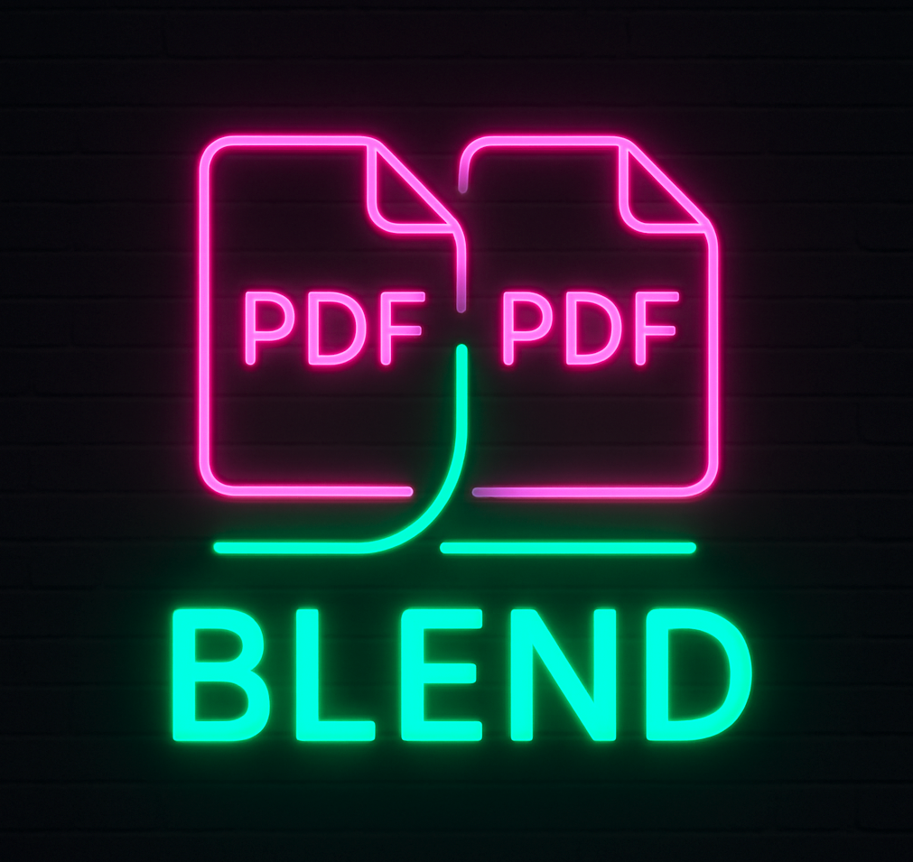
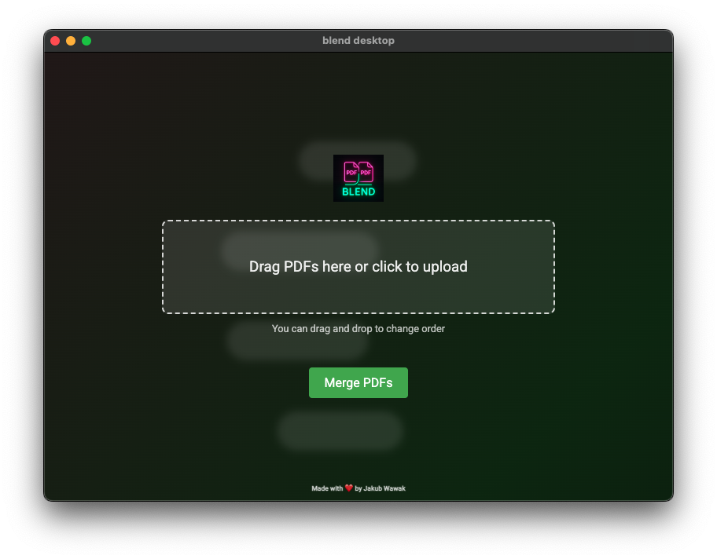

# Blendesktop

A sleek and modern desktop application for merging PDF files. Built with Electron and featuring a beautiful, intuitive user interface with drag-and-drop functionality.



## Features

- 📄 Merge multiple PDF files into a single document
- 🎨 Modern, gradient-animated user interface
- 🖱️ Drag and drop file upload
- ⚡ Fast and efficient PDF processing
- 📋 Reorderable file list
- 💻 Cross-platform support (macOS, Windows, Linux)



## Installation

1. Clone the repository:
```bash
git clone https://github.com/yourusername/blendesktop.git
cd blendesktop
```

2. Install dependencies:
```bash
npm install
```

3. Start the application:
```bash
npm start
```

## Building the Application

To create a distributable package for your platform:

```bash
# Create a directory with executable
npm run pack

# Create a distributable package (DMG for macOS, NSIS for Windows, AppImage for Linux)
npm run dist
```

### Platform-Specific Builds

The application uses electron-builder for creating distributable packages. Here's what you'll get for each platform:

#### macOS
- Builds a `.dmg` installer
- Run: `npm run dist` on macOS
- Output will be in `dist/` directory

#### Windows
- Builds an NSIS installer (`.exe`)
- Run: `npm run dist` on Windows
- Output will be in `dist/` directory

#### Linux
- Builds an AppImage
- Run: `npm run dist` on Linux
- Output will be in `dist/` directory

### Development Build

For development and testing:
```bash
# Install dependencies
npm install

# Start the application in development mode
npm start
```

## Usage

1. Launch the application
2. Add PDF files using one of these methods:
   - Click the upload zone to select files
   - Drag and drop files directly onto the upload area
3. Arrange files in desired order by dragging them in the list
4. Click "Merge PDFs" to combine files
5. Choose a save location for the merged PDF

## Development

The application is built using:
- Electron v36.2.1
- pdf-lib v1.17.1
- @electron/remote v2.1.2

### Project Structure
- `main.js` - Electron main process
- `renderer.js` - Frontend logic
- `index.html` - Application UI
- `package.json` - Project configuration and dependencies

## Author

Jakub Wawak

## License

ISC

## Contributing

1. Fork the repository
2. Create your feature branch (`git checkout -b feature/amazing-feature`)
3. Commit your changes (`git commit -m 'Add some amazing feature'`)
4. Push to the branch (`git push origin feature/amazing-feature`)
5. Open a Pull Request 